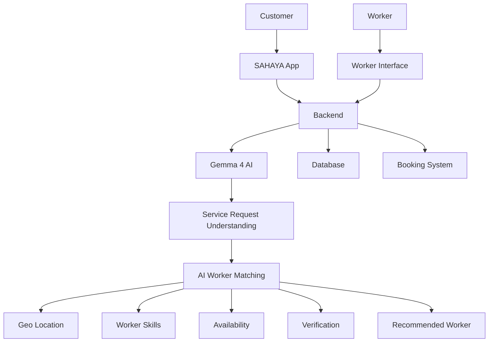

# hacktoberfest_HTF-067

# SAHAYA

> SAHAYA is an AI-powered platform that intelligently connects customers with verified cooperative workers through smart matching, demand forecasting, and accessible voice-based services.
## Team

**Team Name:** DARK PROTOCOL

| Member | 
| ------ | 
| Nithin |  
| Pavna Preethikha M |
| Nehasri Mullapudi |
| Sattineni V S Tulasi Ram | 

## Problem Statement

### The Problem

India’s informal workforce faces low digital access, high commissions, limited worker verification, and weak access to insurance and welfare, while customers struggle to find reliable skilled workers quickly. SAHAYA addresses this gap by connecting customers with verified cooperative workers through an accessible, AI-enabled platform.

### Why We Chose This Problem

We selected this problem because we saw a real gap between skilled informal workers and customers who need reliable services. We believe solving it can improve access to work, reduce unfair commissions, and help workers get better opportunities and welfare support while making it easier for customers to find trusted workers.

## Solution

SAHAYA is an AI-enabled cooperative workforce platform that connects customers with verified informal workers based on their skills, location, availability, and service requirements.
Customers can describe their requirements naturally, while Gemma 4 helps understand and structure the request into information such as service type, problem, and urgency. The system then uses this information to identify suitable workers.
SAHAYA also aims to make digital services more accessible through voice/IVR-based interaction, allowing workers with limited smartphone or digital access to participate in the platform.
The platform brings together AI-based service understanding, worker matching, federation-based verification, digital payments, and worker welfare support in a single ecosystem.

### Key Features

1. AI-Based Service Understanding
2. Verified Worker Matching
3. IVR Accessibility
4. Worker Welfare Ecosystem

## Innovation and Differentiation

SAHAYA is not designed as a conventional worker marketplace. Instead, it combines AI, cooperative worker networks, accessibility, and welfare support into a single platform.
A major differentiator is that the system does not assume every informal worker has strong digital access. The planned voice/IVR interface allows workers to participate using basic phone access.
The platform also focuses on verified cooperative workers rather than an open marketplace, helping establish trust between customers and workers while supporting a more worker-centric economic model.

## Technical Implementation

## Architecture

### Technology Stack

- **AI Model:** Gemma 4
- **AI Matching:** Worker-customer matching based on skills, location, availability, and verification
- **Backend:** [Add your actual backend technology]
- **Frontend:** [Add your actual frontend technology]
- **Database:** [Add your actual database]
- **Location Services:** Geo-location / Maps

### How It Works

1. A customer creates a service request through the SAHAYA application.
2. The customer can describe the requirement using natural language.
3. Gemma 4 processes the request and identifies relevant information such as the required service, problem type, and urgency.
4. The structured request is passed to the worker-matching system.
5. The system considers worker skills, location, availability, and verification status.
6. Suitable workers are ranked and presented to the customer.
7. The customer selects a worker and creates a booking.
8. The booking and service information are stored for future reference.
For workers with limited digital access, the platform can additionally provide a voice/IVR-based interaction mechanism.
### Technical Decisions

We chose a modular architecture so that AI processing, worker matching, authentication, booking, and data management can operate as separate components.
Gemma 4 was selected for natural-language understanding because it allows the application to use an open-weight AI model for processing service requests without depending entirely on proprietary hosted AI APIs.
The AI layer is separated from the matching logic. Gemma converts an unstructured customer request into structured information, while the application logic uses factors such as location, skills, availability, and verification to determine suitable workers.
This separation makes the system easier to test, maintain, and extend.

## Implementation During the Hackathon

[Describe what the team built during the Hack Day and the major functionality or components completed during the event.]

### Team Contributions

- **Nithin:** Backend development
- **Pavna Preethikha M:** Dataset collection, cleaning, and preparation for the AI/ML components.
- **Nehasri Mullapudi:**Frontend development
- **Sattineni V S Tulasi Ram:** Gemma 4 integration & System architecture

## Working Application

**Live Application:** [Live URL]

[Briefly explain how the deployed application can be accessed and what functionality can be tested.]

The submitted application should be functional and accessible through the provided link where applicable.

## Demo Video

**Demo Video:** [Video URL]

[Provide a short demonstration of the working project, covering the main user flow and important functionality.]

## Open Source and AI Usage

### AI / Models

Gemma 4 – Natural-language understanding and service-request processing.
Antigravity – AI-assisted development and implementation.
AI Matching Engine – Intelligent worker–customer matching.
Geo Mapping / Location Services – Location-based worker matching and proximity analysis.

### Usage

Start the application.
Open the application in the browser.
Create/login to a customer account.
Enter a service requirement.
Submit the request.
Gemma 4 processes the request.
Review the structured requirement.
View the recommended workers.
Select a suitable worker and proceed with the booking.

## Devpost Submission

**Devpost Project:** [Devpost Project URL]

## Credits and License

SAHAYA uses open-source technologies and AI components including Gemma 4 and other libraries/frameworks used within the project.

